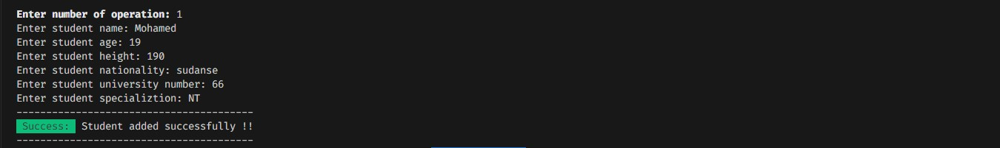

# It is the end of the journey ✨🤗✨

yes freinds it is the final project of progrmming methods 1, it is `Student and Course Management System`;

The progrm manages students data adn courses using fundamental programming principles, arrays, OOP, inhertance, string manipluation and file handling;

## Featurs ✨

- ✅ Add new student
- ✅ Add new course
- ✅ Register student in a course
- ✅ Show students information
- ✅ Show students with courses
- ✅ Various validations

## Technoloy :

- Fundamental programming principles of Java
- Object-oriented Programming
- Inhertance
- String manipluation
- Arrays
- ANSI Codes for style the terminal

## Take a look 📸

